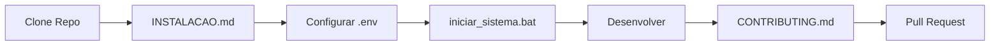
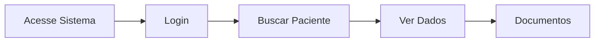
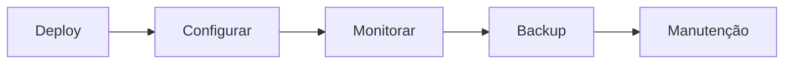

# 📚 Índice de Documentação - Sistema de Automação de Admissão

Bem-vindo à documentação completa do Sistema de Automação de Admissão Hospitalar!

## 🗂️ Estrutura da Documentação

### 📖 Documentos Principais

#### [README.md](README.md) 
**Visão Geral do Projeto**
- Introdução ao sistema
- Tecnologias utilizadas
- Estrutura do projeto
- Funcionalidades principais
- Guia rápido de uso

👉 **Comece aqui se é sua primeira vez no projeto!**

---

#### [INSTALACAO.md](INSTALACAO.md)
**Guia Completo de Instalação**
- Pré-requisitos detalhados
- Instalação passo a passo
- Configuração do ambiente
- Troubleshooting de instalação
- Verificação da instalação

👉 **Use este guia para configurar o projeto do zero!**

---

#### [API.md](API.md)
**Documentação da API REST**
- Todos os endpoints disponíveis
- Parâmetros e respostas
- Exemplos de uso (cURL, JavaScript, Python)
- Códigos de erro
- Rate limiting
- Autenticação

👉 **Consulte este documento para integrar com a API!**

---

#### [SCRIPTS.md](SCRIPTS.md)
**Guia de Scripts e Comandos**
- Scripts batch disponíveis
- Comandos npm
- Scripts Python
- Scripts SQL
- Fluxo de trabalho recomendado

👉 **Use este guia para executar tarefas comuns!**

---

#### [DEPLOY.md](DEPLOY.md)
**Guia de Deploy em Produção**
- Deploy do frontend (Vercel, Netlify, AWS)
- Deploy do backend (Render, Railway, Heroku, VPS)
- Configuração de domínios
- SSL/HTTPS
- Monitoramento
- Backup

👉 **Siga este guia para colocar o sistema em produção!**

---

#### [CONTRIBUTING.md](CONTRIBUTING.md)
**Guia de Contribuição**
- Como contribuir
- Padrões de código
- Processo de Pull Request
- Reportar bugs
- Sugerir melhorias

👉 **Leia este guia antes de contribuir com o projeto!**

---

#### [CHANGELOG.md](CHANGELOG.md)
**Histórico de Versões**
- Versões lançadas
- Mudanças em cada versão
- Roadmap de funcionalidades futuras

👉 **Consulte para ver o histórico de mudanças!**

---

## 🎯 Guias Rápidos

### Para Desenvolvedores



**Passo a passo:**
1. Clone o repositório
2. Siga [INSTALACAO.md](INSTALACAO.md)
3. Configure variáveis de ambiente
4. Execute `iniciar_sistema.bat`
5. Desenvolva e teste localmente
6. Leia [CONTRIBUTING.md](CONTRIBUTING.md)
7. Faça seu Pull Request

---

### Para Usuários



**Acesso:**
1. Acesse o sistema (URL fornecida)
2. Faça login com suas credenciais
3. Busque pacientes por CPF ou nome
4. Visualize dados completos
5. Acesse documentos

---

### Para Administradores



**Processo:**
1. Siga [DEPLOY.md](DEPLOY.md) para deploy
2. Configure variáveis de produção
3. Configure monitoramento (Sentry, Uptime)
4. Configure backup automático
5. Manutenção regular

---

## 📁 Arquivos de Configuração

### Frontend

#### `package.json`
Dependências e scripts do Node.js

#### `src/config.js`
Configurações da aplicação React

#### `tailwind.config.js`
Configurações do Tailwind CSS

#### `tsconfig.json`
Configurações do TypeScript

---

### Backend

#### `backend/requirements.txt`
Dependências Python

#### `backend/.env`
Variáveis de ambiente (não versionado)

#### `backend/.env.example`
Exemplo de variáveis de ambiente

---

### Git

#### `.gitignore`
Arquivos ignorados pelo Git

---

## 🛠️ Ferramentas e Tecnologias

### Frontend
- **React** - [Documentação](https://react.dev/)
- **React Router** - [Documentação](https://reactrouter.com/)
- **Tailwind CSS** - [Documentação](https://tailwindcss.com/)
- **Supabase JS** - [Documentação](https://supabase.com/docs/reference/javascript/)

### Backend
- **Flask** - [Documentação](https://flask.palletsprojects.com/)
- **Supabase** - [Documentação](https://supabase.com/docs)
- **AWS S3** - [Documentação](https://docs.aws.amazon.com/s3/)
- **Google Vertex AI** - [Documentação](https://cloud.google.com/vertex-ai/docs)

### DevOps
- **Vercel** - [Documentação](https://vercel.com/docs)
- **Render** - [Documentação](https://render.com/docs)
- **GitHub Actions** - [Documentação](https://docs.github.com/actions)

---

## 🔍 Busca Rápida

### Tenho um problema de...

#### Instalação
→ [INSTALACAO.md](INSTALACAO.md) - Seção Troubleshooting

#### API não responde
→ [API.md](API.md) - Seção de Erros  
→ [DEPLOY.md](DEPLOY.md) - Troubleshooting

#### Como usar um script
→ [SCRIPTS.md](SCRIPTS.md)

#### Fazer deploy
→ [DEPLOY.md](DEPLOY.md)

#### Contribuir com código
→ [CONTRIBUTING.md](CONTRIBUTING.md)

#### Autenticação/Login
→ [API.md](API.md) - Seção Autenticação  
→ [README.md](README.md) - Seção Autenticação

---

## 📊 Fluxograma de Decisão

```
Preciso de ajuda com...
│
├─ Instalar o sistema
│  └─ Leia: INSTALACAO.md
│
├─ Usar a API
│  └─ Leia: API.md
│
├─ Executar scripts
│  └─ Leia: SCRIPTS.md
│
├─ Fazer deploy
│  └─ Leia: DEPLOY.md
│
├─ Contribuir
│  └─ Leia: CONTRIBUTING.md
│
└─ Entender o sistema
   └─ Leia: README.md
```

---

## 🎓 Tutoriais por Nível

### Iniciante

1. **[README.md](README.md)** - Entenda o que é o sistema
2. **[INSTALACAO.md](INSTALACAO.md)** - Configure o ambiente
3. **[SCRIPTS.md](SCRIPTS.md)** - Execute comandos básicos

### Intermediário

4. **[API.md](API.md)** - Integre com a API
5. **[CONTRIBUTING.md](CONTRIBUTING.md)** - Faça contribuições
6. **Código fonte** - Explore os componentes

### Avançado

7. **[DEPLOY.md](DEPLOY.md)** - Configure produção
8. **Arquitetura** - Entenda a estrutura completa
9. **Otimizações** - Melhore performance

---

## 📞 Suporte

### Documentação
Toda a documentação está disponível neste repositório.

### Issues
Para reportar bugs ou sugerir melhorias, abra uma [Issue](https://github.com/seu-repo/issues).

### Pull Requests
Para contribuir com código, abra um [Pull Request](https://github.com/seu-repo/pulls).

### Contato
- 📧 Email: suporte@exemplo.com
- 💬 Discord/Slack: [Link para comunidade]

---

## ✅ Checklist do Novo Desenvolvedor

Ao entrar no projeto, siga este checklist:

- [ ] Ler [README.md](README.md) completamente
- [ ] Seguir [INSTALACAO.md](INSTALACAO.md) e configurar ambiente
- [ ] Executar `instalar_tudo.bat`
- [ ] Configurar `backend/.env` e `src/config.js`
- [ ] Executar `criar_admin.bat`
- [ ] Executar `iniciar_sistema.bat` e testar
- [ ] Ler [CONTRIBUTING.md](CONTRIBUTING.md)
- [ ] Ler [API.md](API.md) para entender endpoints
- [ ] Explorar código fonte
- [ ] Fazer primeiro commit (pequena melhoria na docs)

---

## 🗺️ Mapa do Repositório

```
automacao-admissao/
│
├── 📄 Documentação
│   ├── README.md              ⭐ Comece aqui
│   ├── INSTALACAO.md          🔧 Instalação
│   ├── API.md                 📡 API Reference
│   ├── SCRIPTS.md             📜 Scripts
│   ├── DEPLOY.md              🚀 Deploy
│   ├── CONTRIBUTING.md        🤝 Contribuir
│   ├── CHANGELOG.md           📝 Versões
│   └── DOCS.md                📚 Este arquivo
│
├── 🎨 Frontend
│   ├── src/                   Código React
│   ├── public/                Assets públicos
│   └── package.json           Dependências
│
├── 🐍 Backend
│   ├── api_admissao.py        API principal
│   ├── api_auth.py            Autenticação
│   ├── requirements.txt       Dependências
│   └── .env.example           Config exemplo
│
├── 🗄️ Dados
│   └── dados/                 CSVs auxiliares
│
├── 🔧 Scripts
│   ├── instalar_tudo.bat      Instalação
│   ├── iniciar_sistema.bat    Iniciar tudo
│   └── criar_admin.bat        Criar admin
│
└── ⚙️ Configuração
    ├── .gitignore             Git config
    ├── tailwind.config.js     Tailwind
    └── tsconfig.json          TypeScript
```

---

## 🎯 Próximos Passos

Depois de ler esta documentação:

1. **Configure o ambiente**: [INSTALACAO.md](INSTALACAO.md)
2. **Explore o código**: Navegue pelos arquivos
3. **Teste localmente**: Execute o sistema
4. **Faça melhorias**: Siga [CONTRIBUTING.md](CONTRIBUTING.md)
5. **Compartilhe**: Ajude outros desenvolvedores

---

## 📚 Glossário

- **apLIS**: Sistema laboratorial de origem
- **Supabase**: Backend as a Service (autenticação, banco)
- **JWT**: JSON Web Token (autenticação)
- **OCR**: Optical Character Recognition (extração de texto)
- **S3**: Amazon Simple Storage Service (armazenamento)
- **RLS**: Row Level Security (segurança Supabase)
- **CORS**: Cross-Origin Resource Sharing
- **Rate Limiting**: Limitação de requisições

---

**Última atualização**: Fevereiro 2026

**Versão da documentação**: 1.0.0
